**请完成以下练习，并给出文字回答或运行结果截图。在下一次课之前，将带有你的结果的文档上传到elearning（文档命名规则为：姓名-学号-20220913.docx）。**

---

## 1.下载并安装Matlab以及SPM 12工具包，将SPM 12添加到Matlab搜索路径

(1).Matlab复旦大学正版软件地址：http://www.ecampus.fudan.edu.cn/2442/list.htm

(2).SPM官方网站：https://www.fil.ion.ucl.ac.uk/spm/software/spm12/

(3).在指定位置下载


 
(4). 解压下载好的文件，将其复制在matlab安装地址中的toolbox下，eg：D:\Program Files\MATLAB\R2022a\toolbox（此处需保证D:\Program Files\MATLAB\R2022a\toolbox内容下是工具包的内容）==，如下图所示：

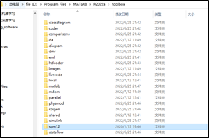
 
(5). 打开matlab软件，在“主页”区选择“设置路径”

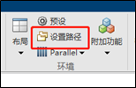
 
(6). 点击“添加子文件夹”，选择刚刚复制的spm12的文件夹路径，保存。

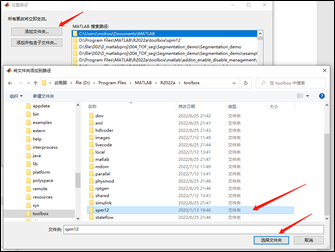
 
(7).验证，在MATLAB控制台console中，输入spm

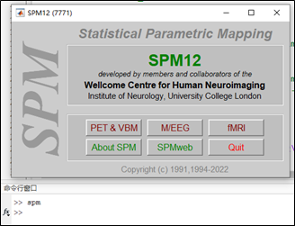

---
 
## 2.下载imshow3D函数(https://ww2.mathworks.cn/matlabcentral/fileexchange/41334-imshow3d)

(1).下载压缩包并解压。例如我的地址为(D:\file\002\9_matlabpackages\imshow3D.m)

(2).跟刚才的步骤一样，进入MATLAB软件，设置路径，添加以上文件目录。

(3).imshow3D的使用方法，可以在命令行中输入 help imshow3D 来查看。

---

## 3.通过网络资料，简单了解TOF-MRA成像和DSA成像

(1).TOF-MRA

TOF-MRA利用流入增强效应，在梯度回波序列中，静止的组织由于短时间内被反复激发产生饱和，而流动的组织由于没有被饱和因此会产生高信号。

(2).DSA

在打血管造影剂之前拍摄一张影像mask像，在打入造影剂合适的时间拍摄一张影像叫充盈像，充盈像与门像相减得到DSA.

---

## 4.使用任意Dicom看读软件（例如试用版的radiant），查看文件夹中的3D TOF原始DICOM图像；使用SPM的图像界面（在Matlab Command window中输入spm fmri），将3D TOF原始DICOM图像转换成NIFTI格式文件；使用以下命令，将所得的NIFTI文件中的图像读取到Matlab的Workspace中，并显示。

```matlab
tof_vol = spm_vol(‘NIFTI文件路径’);
tof = imrotate(spm_read_vols(tof_vol), 90);
figure, imshow3D(tof);
```

(1).使用MedVisLab软件，如图导入相关模块并建立链接，导入DICOM文件。

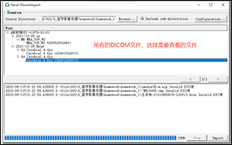
 
横截面与MIP

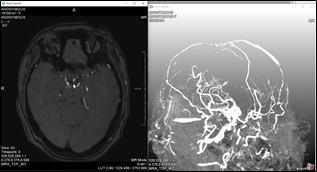
 
DICOM tag信息

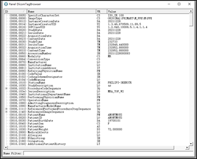
 
(2).输入spm fmri
 
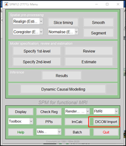  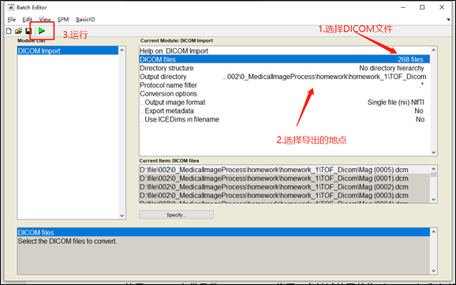
 
(3).使用imshow3d打开nii文件
 
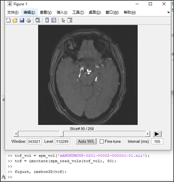

 ---

## 5.使用Matlab自带函数dicomread，将同一名被试的冠状位（coronal）和矢状位(sagittal) DSA DICOM图像（见文件夹DSA_LVA_cor和DSA_LVA_sag）读到Matlab的Workspace，并使用函数imshow显示图像。这两组DSA图像显示的是左侧椎动脉（Left vertebral artery）及其下游分支血管。在Command window中，输入指令imcontrast，调整图像灰度显示范围（即窗宽窗位）。

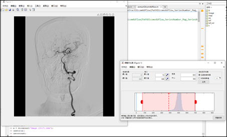

 ---

 ## 6.在Matlab中，对4中的3D TOF图像分别沿第一维和第二维取最大值（该过程称为最大强度投影，maximum intensity projection, MIP。如果取最小值结果又会怎么样？），并对图像做一定旋转（通常是90度）或左右对调，并显示，使其方向与图5中的DSA图像一致。（注：在Matlab中，沿某一维取最大值可使用函数max，图像旋转可使用函数imrotate）

(1)沿着三个方向进行最大投影并旋转到合适角度。

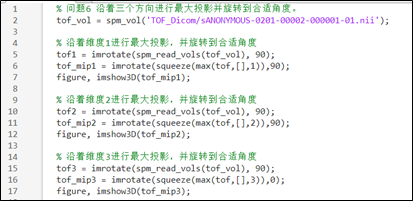

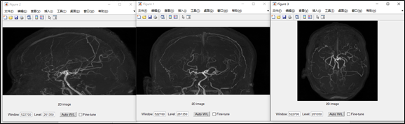

中间的图与图5中的DSA图像观察方向一致。

(2). 沿着三个方向进行最小投影并旋转到合适角度。
 
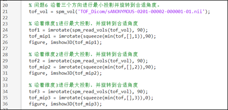

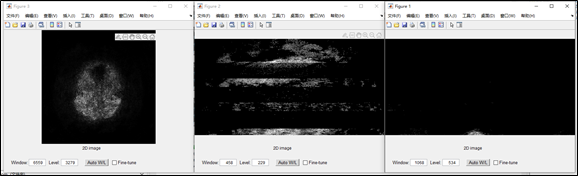

 ---

## 7.根据4-6以及网络资料，简述计算机断层成像与投影成像的主要区别。

计算机断层成像经过重建后，具有三维的空间分辨率。投影成像是三维空间数据沿着某一维度投影，得到的影像只有两个维度的分辨率，无法在第三维进行数据的区分。

---

## 8.使用函数dicominfo读取DICOM文件头，分别找出上述TOF图像和DSA图像的空间分辨率（即体素或像素的尺寸）。（注：空间分辨率包含在标签PixelSpacing，和/或SpacingBetweenSlices，或ImagerPixelSpacing；另外，需要注意的是，这些数值仅表示当前所显示图像的体素或像素大小，并不一定是原始采集分辨率，通常为了提高肉眼观察的效果，成像设备厂商会对原始采集图像进行一定倍数的插值，再保存成Dicom、提供给用户）

(1).显示DSA影像DICOM头文件，和ImagerPixelSpacing
 
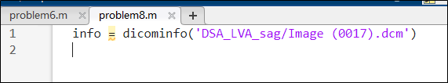

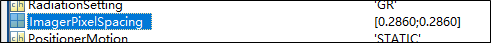
 
(2).显示TOF影像DICOM头文件，和ImagerPixelSpacing
 
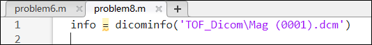

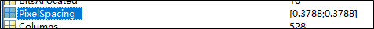

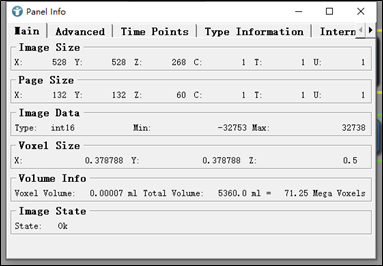
 
可以看到TOF影像层厚为0.5

## 9.根据网络资料，简述DSA Dicom图像中标签DistanceSourceToDetector，DistanceSourceToPatient，PositionerPrimaryAngle和PositionerSecondaryAngle的含义。

(0).使用MATLAB，和MedVisLab打印出 DSA_LVA_cor影像的相关tag
 
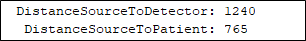

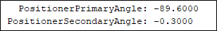

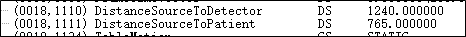

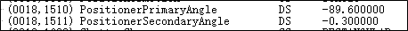

(1). DistanceSourceToDetector

Distance in mm from source to detector center.

推测是X射线管到CCD、数字平板探测器之间的距离。

(2). DistanceSourceToPatient

Distance in mm from source to the table, support or bucky side that is closest to the Imaging Subject, as measured along the central ray of the X-Ray beam.

推测是X射线管，距离病床的床板的距离。

(3). PositionerPrimaryAngle

Position of the X-Ray beam about the patient from the RAO to LAO direction where movement from RAO to vertical is positive, if Positioner Type (0018,1508) is CARM.

RAO(右前斜位) LAO(左前斜位)

X射线管相对于病人，从右到左的角度。例子中-89.6应该表示X射线管在人的左测。
DSA_LVA_sag中这个值为6.49，表示X射线管几乎从正面垂直于人。
这个数值与imrotate函数相结合，可以让TOF三维影像旋转到与DSA相同的角度进行MIP.

(4). PositionerSecondaryAngle

Position of the X-Ray beam about the patient from the CAU to CRA direction where movement from CAU to vertical is positive, if Positioner Type (0018,1508) is CARM.

X射线管相对于病人，从足到头的角度。例子中-0.3表示X射线管在竖直方向上几乎垂直于人。
CRA(头位)  CAU(足位)
