## 请完成以下练习，并给出文字回答或运行结果截图。在下一次课之前，将带有你的结果的文档上传到elearning（文档命名规则为：姓名-学号-2022xxxx.docx）。

---

## 1.将”ASL_PWI.nii”加载到Matlab的Workspace中，使用imshow函数显示第18层。在Command window中输入colorbar，显示颜色条。使用imcontrast函数调整窗宽窗位。（注：ASL_PWI.nii中的图像是一种脑灌注加权图像，反映了脑血流量）
(1) 新建脚本文件，输入命令

 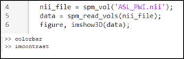

(2) 调整窗宽窗位
 
 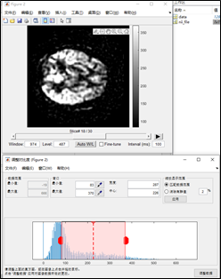

 ---

 ## 2.取出上述第18层图像，将其数值范围调整到0-255，并将数据格式转为uint8（uint8((img - min(img(:))) * 255 / (max(img(:)) - min(img(:))))）。使用imshow函数显示图像及colorbar。输入语句colormap(gca, jet)，使用jet伪彩色图。输入语句cmap = colormap(gca)获取当前显示图像的颜色编码矩阵。将cmap中的第30到70行都设置成黑色（黑色的RGB组成是[0, 0, 0]），将第150-180行都设置成白色（[1, 1, 1]）。使用语句colormap(gca, cmap)，将修改后的颜色编码矩阵应用在当前显示的图像上。

(1)编写代码和输入命令
 
 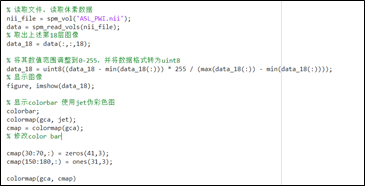

(2)观察color bar和伪彩色color bar变化

 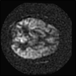
 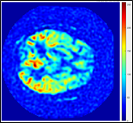
 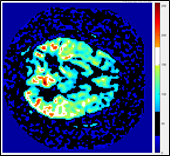

---

## 3.基于ASL_PWI.nii图像进行一个粗糙而简单的脑提取（即分割出脑部区域）：先使用阈值法去除大部分非脑结构，并将灰度图转换成二值图；然后使用形态学开运算（使用imopen函数），去除头皮附近的零星区域；最后使用形态学闭运算（使用imclose函数），填充脑内部的空洞。（注：由于骨头和头皮血流量很少，在ASL_PWI.nii图像中表现为低信号，而脑实质血流量大，表现为高信号，因此基于阈值法对ASL_PWI.nii做简单的脑提取是可行的。）

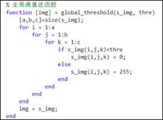

a.	在形态学运算中，需要先使用strel函数生成一个结构元素。请在该练习中分别尝试使用二维和三维结构元素。

(1)分别定义二维和三维结构元素

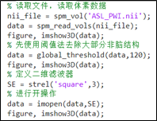
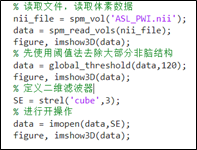

(2)观察原始图像、二值图、开操作后的二值图。
 
 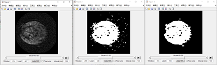

上图为二维结构元素，下图为三维结构元素。三维结构元素对原图改动更大。

 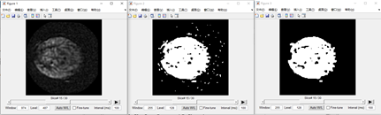

---

## 4.DICOM图像的文件头包含了图像像素的空间位置信息，这些文件头标签包括PixelSpacing，SpacingBetweenSlices， ImagePositionPatient， ImageOrientationPatient等。在将DICOM图像转换成NIFTI文件时，这些空间位置信息将以一个4x4的仿射变换矩阵的形式存放在NIFTI文件的文件头中。

a.	使用语句tof_vol = spm_vol(‘TOF.nii’)语句将上一次练习（”2 Exercise.docx”）生成的TOF图像NIFTI文件的文件头导入到Matlab Workspace中。其中，tof_vol.mat即为仿射变换矩阵。计算tof_vol.mat矩阵每一列向量的模，观察这些模值与PixelSpacing和SpacingBetweenSlices的关系。

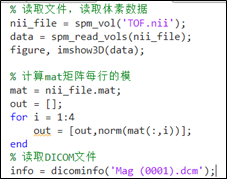
 
DICOM图像的文件头信息

PixelSpacing	[0.378;0.378]

SpacingBetweenSlices	0.5

ImagePositionPatient	[-98.042;-95.841;-26.069]

ImageOrientationPatient	[0.999;-0.011;0.021;0.014;0.987;-0.158]

nii中4x4的仿射变换矩阵
 
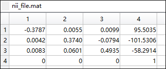

nii每一列向量的模
 
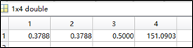

第一列与第二列的模与PixelSpacing值相等。第三列的模与SpacingBetweenSlices的值相等。

---

## 5.基于所存储的仿射变换矩阵，不同NIFTI文件（或者其它类似的文件格式）之间很容易实现图像的插值。SPM工具包中的spm_reslice函数可用于NIFTI文件之间的插值。打开spm_reslice.m代码文件，根据文件开头的注释了解NIFTI文件仿射变换矩阵的含义。

a.	本练习提供的ASL_PWI.nii文件和T1W.nii文件来自于同一个患者的同一次检查，二者的分辨率、方位（一个是轴位，一个是矢状位）、成像空间范围都不相同。如果在采集这两个图像的过程中，患者头部没有发生运动并且图像不存在畸变，那么通过图像插值，可以将一个图像插值到另一个图像（即参考图像）的空间中，插值后的图像与参考图像中的组织空间位置是完全一样的。运行下面代码，将T1W.nii插值到ASL_PWI.nii图像空间。然后将插值后的T1W图导入Matlab，并将其与ASL_PWI并排显示。

```matlab
ref_vol = spm_vol(‘ASL_PWI.nii’);
to_reslice_vol = spm_vol(‘T1W.nii’);
prefix = 'resliced_';
resflags = struct(...
    'mask',0,... % will not mask anything
    'mean',0,... % will not write mean image
    'which',1,... % write only the coregistered file
    'interp',1,... 
    'prefix', prefix);
spm_reslice([ref_vol; to_reslice_vol], resflags); 

```

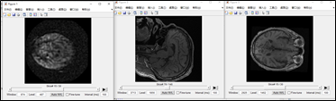

b.	采用相同方法，将ASL_PWI.nii图像插值到T1W.nii图像空间。

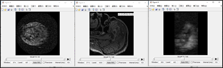