## 请完成以下练习，并给出文字回答或运行结果截图。在下一次课之前，将带有你的结果的文档上传到elearning（文档命名规则为：姓名-学号-2022xxxx.docx）。

---

## 1.下面练习使用SPM生成一个新的NIFTI文件：使用以下句子将3 Exercise中的”T1W.nii”加载到Matlab中，并生成一个新的NIFTI文件（仅命名与原文件不一样，数据完全一致）
```MATLAB
img_vol = spm_vol(‘T1W.nii’);
img = spm_read_vols(img_vol);
img_vol2 = img_vol;
img_vol2.fname = ‘new_T1W.nii’;
img2 = img;
spm_write_vol(img_vol2, img2);
```
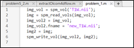


---

## 2.对img进行裁减操作，例如取出部分区域img_crop = img(50:150, 100:250, 30:120)，并创建相应的NIFTI文件头，使用spm_write_vol生成一个新的NIFTI文件（假设命名为“cropped_T1W.nii”）。使用spm_reslice函数，将“cropped_T1W.nii”插值到“T1W.nii”，并显示，以验证所创建的NIFTI文件头是否正确。另外，请也生成将图像左右翻转后的NIFTI文件，即img_flip = img(:, end:-1:1, :)？（提示：创建文件头时，只需修改原文件头中的dim和mat域。在创建文件头的mat域时，由于已知原图像和裁减后的图像的像素对应关系，可以基于以下公式推导计算出新仿射变换矩阵（即mat）各元素的数值）

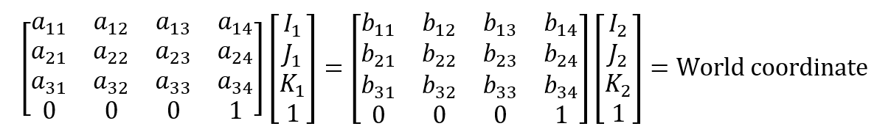

### (1).裁剪图像，保存为cropped_T1W.nii，旋转图像保存为invert_cropped_T1W.nii
 
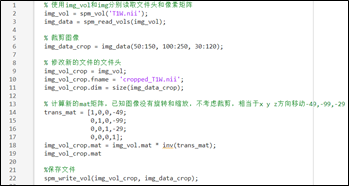
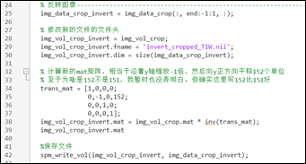

至于为什么是152，猜想可能是1变-1，需要移动2个单位。151变-151，-151需要移动152才能到1的位置。

### (2).验证仿射变换矩阵是否正确

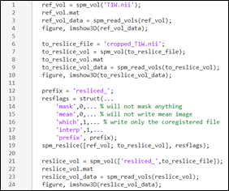
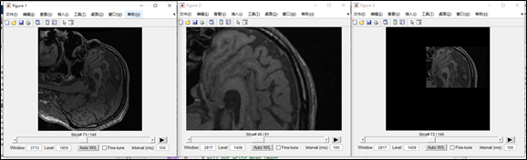
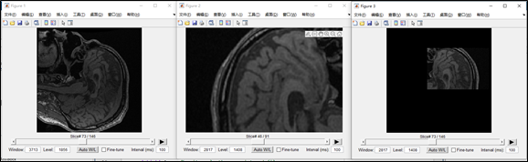

---
 
## 3.读取”T2W_Head.dcm”（假设变量为img），将图像数值归一化到[0, 1]。使用语句img_noise = img + 0.1*rand(size(img))添加图像噪声。

### a.使用fft2函数计算img_noise的傅立叶变换，并显示（注：为了让图像的频谱图的低频处于图像中心，需要使用fftshift对fft2的结果进行位置调整）
 
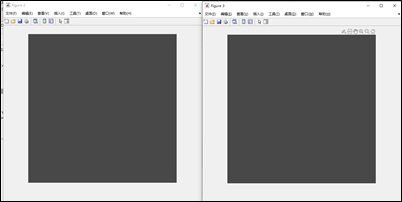

### b.假设fft2和fftshift后的结果为Fc，对Fc做对数变换（即log(1+abs(Fc))），并显示

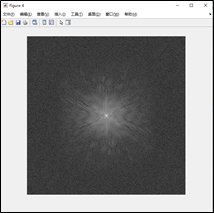

### c.选取一定频率域半径值，设计一个频率域理想低通滤波器，用于对img_noise平滑去噪；设计一个频率域高斯低通滤波器，用于对img_noise平滑去噪。将img，img_noise和平滑后的图像并排显示。

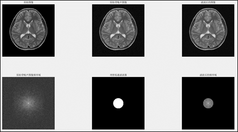
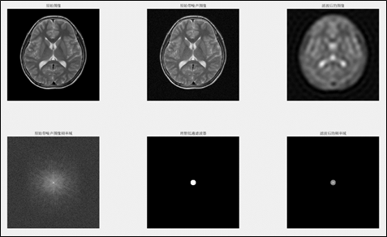
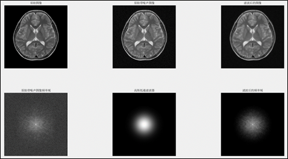

可以观察到，滤波器半径越小，高频信息丢失越多，图像越模糊。使用理想低通滤波器，会出现振铃效应。使用高斯低通滤波器可以避免这个现象。

---

## 4.通过阅读论文“Multiscale vessel enhancement filtering”，了解Frangi vesselness滤波器，并简述其数学原理。Matlab自带函数fibermetric实现了Frangi滤波器，请使用该函数对“2 Exercise.docx”中的TOF图像的最大强度投影图（沿第三维）进行血管增强，请深度使用不用的thickness（见fibermetric函数的说明）（注：在使用fibermetric之前，建议将图像的数值归一化到[0, 1]，否则需要自己指定“StructureSensitivity”参数的数值。Frangi滤波器的另一个实现：https://ww2.mathworks.cn/matlabcentral/fileexchange/24409-hessian-based-frangi-vesselness-filter）。

基本原理：通过计算空间中任一点的二阶偏导数，Hessian矩阵是由二阶偏导数组成。

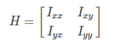

根据数学上极最值点的判定规则和hessian矩阵三个特征值的正负性和大小关系，判断当前空间点是球、管状、平面、噪声的可能性。通过设置滤波器的半径，可以选择增强更粗的血管还是更细的血管。

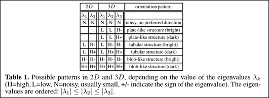

特征值大小与正负性对应可能的形状、亮血、黑血信号。

 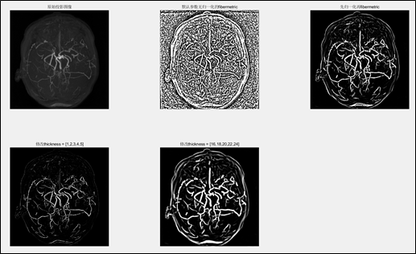

---

## 代码部分 整理自用

1.1
```matlab
img_vol = spm_vol('T1W.nii');
img = spm_read_vols(img_vol);
img_vol2 = img_vol;
img_vol2.fname = 'new_T1W.nii';
img2 = img;
spm_write_vol(img_vol2, img2);
```

2.1
```matlab
% 使用img_vol和img分别读取文件头和像素矩阵
img_vol = spm_vol('T1W.nii');
img_data = spm_read_vols(img_vol);

% 裁剪图像
img_data_crop = img_data(50:150, 100:250, 30:120);

% 修改新的文件的文件头
img_vol_crop = img_vol;
img_vol_crop.fname = 'cropped_T1W.nii';
img_vol_crop.dim = size(img_data_crop);

% 计算新的mat矩阵，已知图像没有旋转和缩放，不考虑裁剪，相当于x y z方向移动-49,-99,-29
trans_mat = [1,0,0,-49;
             0,1,0,-99;
             0,0,1,-29;
             0,0,0,1];
img_vol_crop.mat = img_vol.mat * inv(trans_mat);
img_vol_crop.mat

%保存文件
spm_write_vol(img_vol_crop, img_data_crop);

% 反转图像----------------------------------------------------------------------------------
img_data_crop_invert = img_data_crop(:, end:-1:1, :);

% 修改新的文件的文件头
img_vol_crop_invert = img_vol_crop;
img_vol_crop_invert.fname = 'invert_cropped_T1W.nii';
img_vol_crop_invert.dim = size(img_data_crop_invert);

% 计算新的mat矩阵，相当于沿着y轴缩放-1倍，然后向y正方向平移152个单位
% 至于为啥是152不是151，我暂时也没弄明白。但确实这里写152比151好
trans_mat = [1,0,0,0;
             0,-1,0,152;
             0,0,1,0;
             0,0,0,1];
img_vol_crop_invert.mat = img_vol_crop.mat * inv(trans_mat);
img_vol_crop_invert.mat

%保存文件
spm_write_vol(img_vol_crop_invert, img_data_crop_invert);

```

2.2
```matlab
ref_vol = spm_vol('T1W.nii');
ref_vol.mat
ref_vol_data = spm_read_vols(ref_vol);
figure, imshow3D(ref_vol_data);

to_reslice_file = 'cropped_T1W.nii';
to_reslice_vol = spm_vol(to_reslice_file);
to_reslice_vol.mat
to_reslice_vol_data = spm_read_vols(to_reslice_vol);
figure, imshow3D(to_reslice_vol_data);

prefix = 'resliced_';
resflags = struct(...
    'mask',0,... % will not mask anything
    'mean',0,... % will not write mean image
    'which',1,... % write only the coregistered file
    'interp',1,... 
    'prefix', prefix);
spm_reslice([ref_vol; to_reslice_vol], resflags); 

reslice_vol = spm_vol(['resliced_',to_reslice_file]);
reslice_vol.mat
reslice_vol_data = spm_read_vols(reslice_vol);
figure, imshow3D(reslice_vol_data);

```

2.3
```matlab
ref_vol = spm_vol('T1W.nii');
ref_vol.mat
ref_vol_data = spm_read_vols(ref_vol);
figure, imshow3D(ref_vol_data);

to_reslice_file = 'invert_cropped_T1W.nii';
to_reslice_vol = spm_vol(to_reslice_file);
to_reslice_vol.mat
to_reslice_vol_data = spm_read_vols(to_reslice_vol);
figure, imshow3D(to_reslice_vol_data);

prefix = 'resliced_';
resflags = struct(...
    'mask',0,... % will not mask anything
    'mean',0,... % will not write mean image
    'which',1,... % write only the coregistered file
    'interp',1,... 
    'prefix', prefix);
spm_reslice([ref_vol; to_reslice_vol], resflags); 

reslice_vol = spm_vol(['resliced_',to_reslice_file]);
reslice_vol.mat
reslice_vol_data = spm_read_vols(reslice_vol);
figure, imshow3D(reslice_vol_data);
```

3.1
```matlab
% 读取dicom文件
head_image = dicomread('T2W_Head.dcm');
% figure; subplot(2,3,1); imshow(head_image); title('原始图像');

% 将图像归一化到[0,1]
head_image_normal = rescale(head_image);
figure; subplot(2,3,1); imshow(head_image_normal); title('原始图像');

% 添加图像噪声
head_image_normal_noize = head_image_normal + 0.1*rand(size(head_image_normal));
subplot(2,3,2); imshow(head_image_normal_noize); title('原始带噪声图像');

% 使用fft2和fftshift得到傅里叶变换
head_image_fft= fft2(head_image_normal_noize);
% figure, imshow(rescale(real(head_image_fft)))
head_image_ffts= fftshift(head_image_fft);
% figure, imshow(rescale(real(head_image_ffts)))

% 对fc(head_image_ffts)做对数变换
head_image_ffts_log = log(1+abs(head_image_ffts));
subplot(2,3,4); imshow(rescale(real(head_image_ffts_log))); title('原始带噪声图像频率域');


% 设计滤波器 生成网格坐标
[M,N] = size(head_image_normal_noize);
u = -N/2:N/2-1;
v = -M/2:M/2-1;
[U,V] = meshgrid(u,v);    % 生成网格
D = hypot(U,V);           % 中心为0的同心圆数组
D0 = 50;                  % 设置截止频率，越大越清晰
H = mat2gray( D <= D0 );  % 理想低通滤波器
subplot(2,3,5); imshow(H);title('理想低通滤波器');

head_image_ffts_f = head_image_ffts.*H;  %进行滤波
subplot(2,3,6); imshow(rescale(log(1+abs(head_image_ffts_f))));title('滤波后的频率域');

head_image_ffts_f_if = ifft2(fftshift(head_image_ffts_f)); %傅里叶反变换
subplot(2,3,3); imshow(head_image_ffts_f_if);title('滤波后的图像');

```

3.2
```matlab
% 读取dicom文件
head_image = dicomread('T2W_Head.dcm');
%figure; subplot(2,3,1); imshow(head_image); title('原始图像');

% 将图像归一化到[0,1]
head_image_normal = rescale(head_image);
figure; subplot(2,3,1); imshow(head_image_normal); title('原始图像');

% 添加图像噪声
head_image_normal_noize = head_image_normal + 0.1*rand(size(head_image_normal));
subplot(2,3,2); imshow(head_image_normal_noize); title('原始带噪声图像');

% 使用fft2和fftshift得到傅里叶变换
head_image_fft= fft2(head_image_normal_noize);
% figure, imshow(rescale(real(head_image_fft)))
head_image_ffts= fftshift(head_image_fft);
% figure, imshow(rescale(real(head_image_ffts)))

% 对fc(head_image_ffts)做对数变换
head_image_ffts_log = log(1+abs(head_image_ffts));
subplot(2,3,4); imshow(rescale(real(head_image_ffts_log))); title('原始带噪声图像频率域');

% 创建滤波器
[M,N] = size(head_image_normal_noize);
F = rescale(fspecial('gaussian',[M,N],50));
subplot(2,3,5); imshow(F); title('高斯低通滤波器');

head_image_ffts_f = head_image_ffts.*F;  %进行滤波
subplot(2,3,6); imshow(rescale(log(1+abs(head_image_ffts_f))));title('滤波后的频率域');

head_image_ffts_f_if = ifft2(fftshift(head_image_ffts_f)); %傅里叶反变换
subplot(2,3,3); imshow(head_image_ffts_f_if);title('滤波后的图像');

```

3.3
```matlab
% 读取dicom文件
head_image = dicomread('T2W_Head.dcm');
% figure; subplot(2,3,1); imshow(head_image); title('原始图像');

% 将图像归一化到[0,1]
head_image_normal = rescale(head_image);
figure; subplot(2,3,1); imshow(head_image_normal); title('原始图像');

% 添加图像噪声
head_image_normal_noize = head_image_normal + 0.1*rand(size(head_image_normal));
subplot(2,3,2); imshow(head_image_normal_noize); title('原始带噪声图像');

% 使用fft2和fftshift得到傅里叶变换
head_image_fft= fft2(head_image_normal_noize);
% figure, imshow(rescale(real(head_image_fft)))
head_image_ffts= fftshift(head_image_fft);
% figure, imshow(rescale(real(head_image_ffts)))

% 对fc(head_image_ffts)做对数变换
head_image_ffts_log = log(1+abs(head_image_ffts));
subplot(2,3,4); imshow(rescale(real(head_image_ffts_log))); title('原始带噪声图像频率域');


% 设计滤波器 生成网格坐标
[M,N] = size(head_image_normal_noize);
u = -N/2:N/2-1;
v = -M/2:M/2-1;
[U,V] = meshgrid(u,v);    % 生成网格
D = hypot(U,V);           % 中心为0的同心圆数组
D0 = 15;                  % 设置截止频率，越大越清晰
H = mat2gray( D <= D0 );  % 理想低通滤波器
subplot(2,3,5); imshow(H);title('理想低通滤波器');

head_image_ffts_f = head_image_ffts.*H;  %进行滤波
subplot(2,3,6); imshow(rescale(log(1+abs(head_image_ffts_f))));title('滤波后的频率域');

head_image_ffts_f_if = ifft2(fftshift(head_image_ffts_f)); %傅里叶反变换
subplot(2,3,3); imshow(head_image_ffts_f_if);title('滤波后的图像');


```

4.1
```matlab
% 读取tof影像
tof = spm_vol('tof.nii');
tof_data = spm_read_vols(tof);
% 沿着第三轴进行最大投影，并旋转
tof_data_rotate = imrotate(squeeze(max(tof_data,[],3)),90);
% 使用fibermetric进行血管增强
tof_data_rotate_fib = fibermetric(tof_data_rotate);
% 先归一化再fibermetric
tof_data_rotate_rs_fib = fibermetric(rescale(tof_data_rotate));
% 修改thickness = [1,2,3,4,5]
tof_data_rotate_rs_fib_t1 = fibermetric(rescale(tof_data_rotate), [1,2,3,4,5]);
% 修改thickness = [16,18,20,22,24]
tof_data_rotate_rs_fib_t2 = fibermetric(rescale(tof_data_rotate), [16,18,20,22,24]);
figure;
subplot(2,3,1); imshow(rescale(tof_data_rotate)); title('原始投影图像');
subplot(2,3,2); imshow(rescale(tof_data_rotate_fib)); title('默认参数无归一化的fibermetric');
subplot(2,3,3); imshow(rescale(tof_data_rotate_rs_fib)); title('先归一化再fibermetric');
subplot(2,3,4); imshow(rescale(tof_data_rotate_rs_fib_t1)); title('修改thickness = [1,2,3,4,5]');
subplot(2,3,5); imshow(rescale(tof_data_rotate_rs_fib_t2)); title('修改thickness = [16,18,20,22,24]');

```